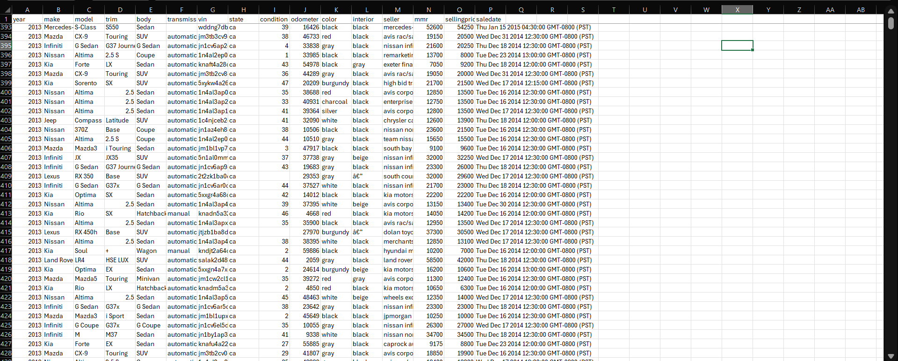
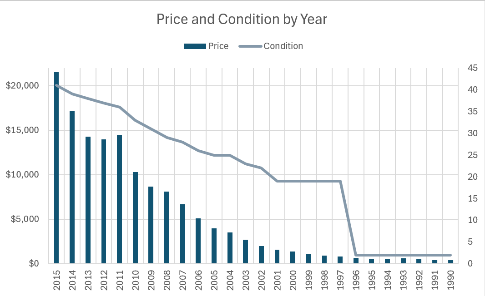
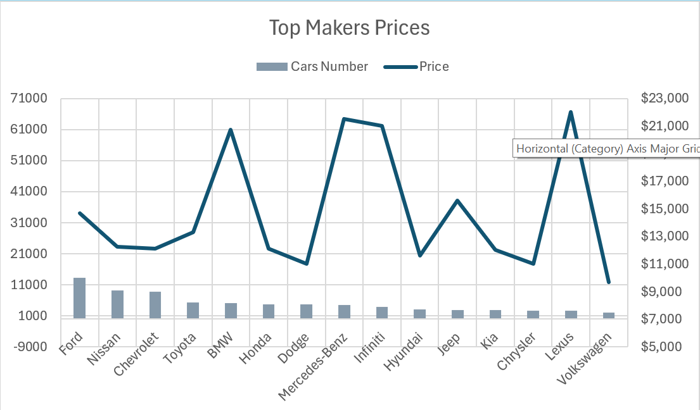
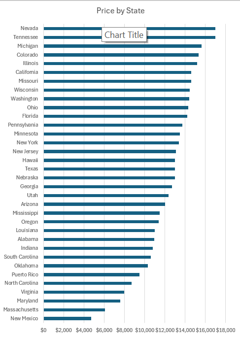
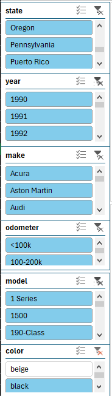

<<<<<<< HEAD
Car Sales Dashboard
This project analyzes raw car sales data and visualizes key insights through interactive charts and slicers. It’s designed to help users explore car prices, sales trends, and distribution by state, company, and car characteristics.

1. Raw Data
The dataset includes car listings with attributes such as:
Year
Maker (Company)
Model
Price
Condition
Odometer
Color
State
Figure 1:

3. Charts

2.1 Price vs Condition by Year
This chart shows how car prices and conditions vary depending on the manufacturing year. It helps identify trends in depreciation and quality across different years.
Figure 2: 

2.2 Cars Sold and Median Price by Company
This chart shows the number of cars sold for each manufacturer along with the median price, giving insight into brand popularity and market value.
Figure 3: 

2.3 Median Price by State
This chart highlights the median car price across different states, which helps identify regional price differences and trends.
Figure 4: 

3. Slicers (Filters)
The dashboard includes interactive slicers to filter the charts by:
State
Year
Maker (Company)
Odometer
Model
Color
Figure 5:

5. How to Use
Clone the repository.
Open the dashboard file.
Use the slicers to filter data and explore trends in car sales and prices.

6. Insights
Older cars tend to have lower prices and poorer conditions.
Some manufacturers have high sales volumes but lower median prices, indicating affordability.
Median prices vary significantly by state, reflecting local market differences.
=======
# Car_Prices_Analysis_ExcelProject
>>>>>>> ce09b10f810c1cf1e4d9012ff21fadb8b0e7c4a7
